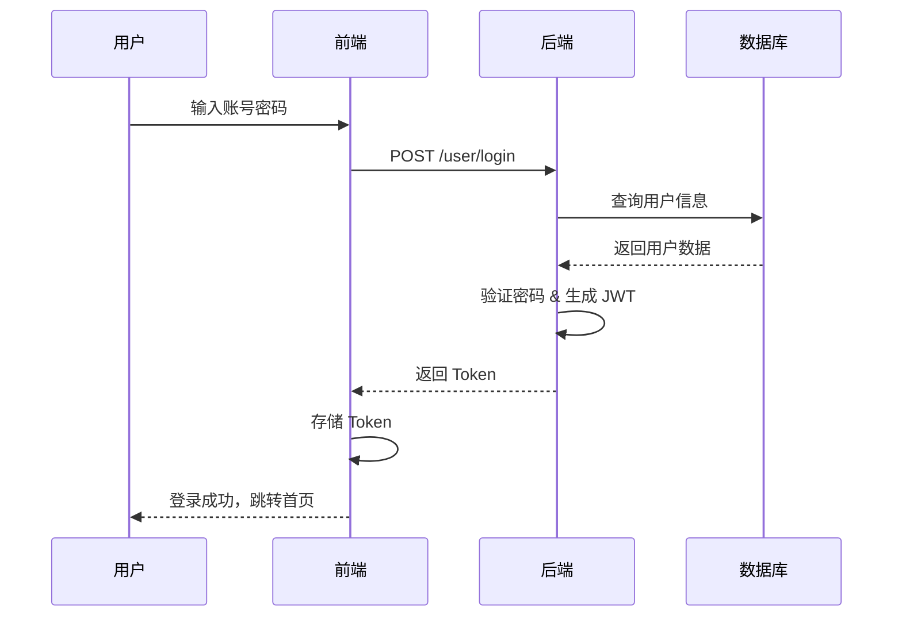
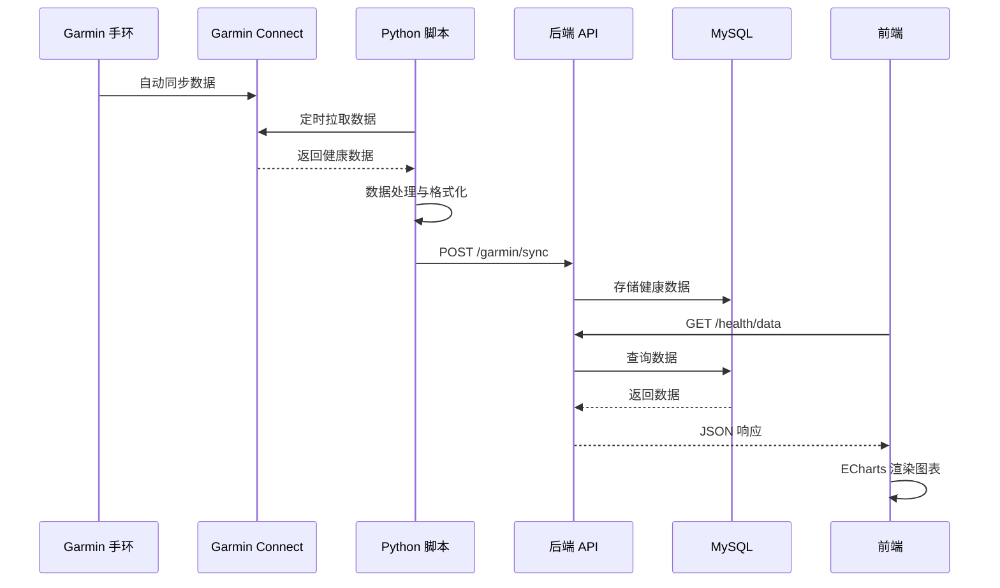
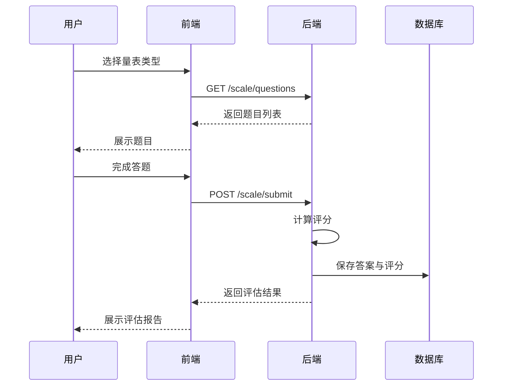

# 💖健康关怀系统 (Health Care System)

<div align="center">

[](https://spring.io/) [](https://vuejs.org/) [](https://uniapp.dcloud.net.cn/) [](https://www.mysql.com/) [](https://www.python.org/) [](https://layui.dev/) [](https://connect.garmin.com/)

</div>

---

## 📋 项目简介

1. 官网页：https://z.playe.top
2. H5版本：https://h.playe.top
3. 后台管理系统：https://www.nwpuhs.cn/
4. 移动端：https://xiaoye66.lanzoum.com/iRh6S3qbcv9i
5. 简介：健康关怀系统是一个集成了移动端跨平台 App /H5与 Web 管理后台的心理健康检测管理平台。系统旨在通过多维度的数据采集与分析，帮助用户自我调节并辅助医护人员更好地评估、管理患者的心理与生理健康状况。


 ### ✨ 核心特性

- **心理健康评估** - 支持 SDS、SAS、PSS、SCL-90、PSQI、OCEAN、MAIA-2、CD-RISC、IPAQ、PARS-3 等 10+ 种专业心理量表。
- **AI 心理陪伴** - 内置"心晴" AI 心理助手，提供 24h专业情绪倾诉与对话陪伴。
- **HTP 房树人投射测验** - 支持房树人HTP测验，通过 AI 对绘画图像进行多维度量化分析并生成智能报告。
- **综合健康报告** - 整合心理量表、手环生理指标、日常填报，自动生成多维度雷达图的综合健康报告。
- **智能手环数据同步** - 基于 Garmin Connect API，自动定时拉取并存储心率、睡眠、步数、血氧、压力和身体能量。
- **情绪瞬时评估 (EMA)** - 支持生态瞬时情绪评估（EMA），记录瞬时情绪变化并生成情绪分析图表。
- **疗愈空间生态** - 集成 AI 对话、冥想音频引导、情绪日记与疗愈游戏，构建"评估-疗愈-追踪"的心理闭环。
- **三维动态官网宣传页** - 提供专为平台设计、适配 PC 和移动端的 3D 官网宣传页 (`/welcome.html`)，包含炫酷的 3D 卡片轮播、ECharts 雷达图数据排版及平滑过渡动效，支持无缝跳转登录页。
- **专业后台管理** - 提供基于 LayuiMini 的医生/管理员后台，支持用户管理、量表分析、HTP 绘画分析、AI 聊天分析、日记分析与综合健康报告查看。
- **消息推送系统** - 集成极光推送（JPush）与主流硬件厂商通道，支持健康数据填报、用药与量表提醒。
- **自动化脚本支持** - 配备一键本地运行脚本 `run_backend.ps1` 和一键自动打包部署脚本 `deploy.ps1`。

---

## ⚙️ 技术栈

### 🖥️ 前端技术

| 技术 | 版本 | 说明 |
|------|------|------|
| **uni-app** | 最新版 | 跨平台应用开发框架（iOS / Android / H5） |
| **Vue.js** | 2.x | 前端 MVVM 框架 |
| **uView UI** | 最新版 | uni-app UI 组件库 |
| **ECharts (lime-echart)** | 最新版 | 数据可视化图表库 |
| **HBuilderX** | 最新版 | 官方开发工具 |
| **Layui** | 最新版 | 前端 UI 框架 |
| **jQuery** | 最新版 | JavaScript DOM 交互库 |
| **Font Awesome** | 4.7.0 | 图标样式库 |
| **ECharts** | 最新版 | 后台数据分析可视化图表库 |


### ⚡ 后端技术
| 技术 | 版本 | 说明 |
|------|------|------|
| **Spring Boot** | 2.3.4 | 后端核心框架 |
| **MyBatis** | 2.1.3 | ORM 持久层框架 |
| **MySQL** | 8.0+ | 关系型数据库 |
| **Druid** | 1.1.8 | 数据库连接池 |
| **Apache Shiro** | 1.3.2 | 安全认证框架 |
| **JWT (auth0)** | 3.2.0 | Token 认证 |
| **Swagger / Knife4j** | 2.9.2 / 2.0.4 | API 文档工具 |
| **极光推送** | 3.7.6 | 消息推送服务 |
| **Hutool** | 5.3.3 | Java 工具类库 |
| **Lombok** | 最新版 | 代码简化注解 |
| **ZXing** | 3.3.3 | 二维码生成库 |
| **Thymeleaf** | 最新版 | 模板引擎 |
| **Commons-IO** | 2.6 | 文件操作工具 |
| **LayuiMini** | 2.x | 后台管理系统模块框架 |


### 🤖 第三方集成

| 服务 | 说明 |
|------|------|
| **Garmin Connect API** | 智能手环数据同步（Python 集成） |
| **极光推送 (JPush)** | 移动端消息推送 |
| **厂商推送** | OPPO、VIVO、华为、荣耀、小米等厂商通道 |

---


## 📁 目录结构

### 🖥️ 前端目录结构

```
frontend/
├── pages/                          # 页面目录
│   ├── home/                      # 启动引导页
│   ├── index/                     # 首页（数据总览）
│   ├── login/                     # 登录注册
│   │   ├── login.vue             # 登录页
│   │   ├── reg.vue               # 注册页
│   │   ├── forget.vue            # 忘记密码
│   │   └── agreement.vue         # 用户协议
│   ├── aiassess/                  # AI 评估中心（Tab 底部栏）
│   │   └── aiassess.vue          # 三Tab：画画/测评/评估
│   ├── heal/                      # 疗愈空间（Tab 底部栏）
│   │   └── heal.vue              # 四Tab：聊天/游戏/冥想/日记
│   ├── mine/                      # 我的（Tab 底部栏）
│   │   ├── mine.vue              # 个人中心
│   │   ├── HealthReport.vue      # 综合健康报告（雷达图）
│   │   ├── privacyPolicy.vue     # 隐私政策
│   │   ├── collection.vue        # 个人信息明示清单
│   │   └── sdk.vue               # 第三方SDK使用清单
│   ├── me/                        # 设置相关
│   │   ├── index.vue             # 我的主页
│   │   ├── ChangePass.vue        # 修改密码
│   │   └── setting.vue           # 设置
│   ├── Scale/                     # 心理量表（共10+个量表）
│   │   ├── SDS.vue               # 抑郁自评量表（20题）
│   │   ├── SAS.vue               # 焦虑自评量表（20题）
│   │   ├── PSS.vue               # 压力感知量表（14题）
│   │   ├── SCL90.vue             # 症状自评量表（90题）
│   │   ├── PSQI.vue              # 睡眠质量指数（18题）
│   │   ├── OCEAN.vue             # 大五人格量表（60题）
│   │   ├── MAIA2.vue             # 多维内感受意识量表（37题）
│   │   ├── CDRISC.vue            # 心理弹性量表（25题）
│   │   ├── IPAQ.vue              # 国际体力活动量表（7题）
│   │   ├── PARS3.vue             # 体育活动等级量表（5题）
│   │   └── HTP.vue               # 房树人心理测验（绘画投射）
│   ├── Response/                  # 测评报告页
│   │   ├── RePHQ.vue             # 抑郁报告
│   │   ├── ReSAS.vue             # 焦虑报告
│   │   ├── RePSS.vue             # 压力报告
│   │   └── ReDailyR.vue          # 日常状态报告
│   ├── Chart/                     # 历史图表
│   │   ├── ChartMain.vue         # 图表主页
│   │   ├── DailyReportChart.vue  # 日常状态历史
│   │   ├── PAMChart.vue          # 情绪历史
│   │   ├── DepressionChart.vue   # 抑郁评估历史
│   │   ├── PHQ9Chart.vue         # PHQ-9 历史
│   │   ├── PSSChart.vue          # 压力历史
│   │   └── SASChart.vue          # 焦虑历史
│   ├── BraceletData/              # 手环数据
│   │   ├── BraceletData.vue      # 手环数据总览
│   │   ├── HeartRateChart.vue    # 心率历史
│   │   ├── SleepChart.vue        # 睡眠历史
│   │   ├── DailyStepsChart.vue   # 步数历史
│   │   ├── BodyEnergyChart.vue   # 身体能量历史
│   │   ├── StressChart.vue       # 压力历史
│   │   └── Sp02Chart.vue         # 血氧历史
│   ├── health/                    # 健康信息
│   │   ├── BasicInfo.vue         # 基本信息填写
│   │   └── DailyReport.vue       # 日常状态填报
│   ├── Emotion/                   # 情绪评估
│   │   └── EMA.vue               # 生态瞬时评估
│   ├── news/                      # 推荐资讯
│   │   ├── news.vue              # 资讯列表
│   │   ├── detail.vue            # 新闻详情
│   │   └── publish.vue           # 发布资讯
│   ├── video/                     # 视频访谈
│   │   └── Video.vue             # 迷你访谈
│   └── pagerouters/               # 内容路由页（经典推荐内容）
│       ├── pagerouter1~7.vue     # 经典推荐内容页
│       └── GameWebview.vue       # 游戏 Webview 页
├── components/                    # 公共组件
│   ├── basic-table/              # 表格组件
│   ├── uni-forms/                # 表单组件
│   ├── uni-forms-item/           # 表单项组件
│   ├── uni-icons/                # 图标组件
│   ├── uni-easyinput/            # 输入框组件
│   ├── ir-date-time-picker/      # 日期时间选择器
│   ├── nx-search/                # 搜索组件
│   └── swiper/                   # 轮播组件
├── nxTemp/                        # 工具库
│   ├── apis/                     # API 接口定义
│   ├── config/                   # 全局配置（baseUrl 等）
│   ├── request/                  # HTTP 请求封装
│   ├── store/                    # Vuex 状态管理
│   ├── router/                   # 路由配置
│   ├── utils/                    # 工具函数（jsencrypt 等）
│   └── filter/                   # 过滤器
├── uni_modules/                   # uni-app 插件
│   ├── lime-echart/              # ECharts 图表组件
│   ├── uview-ui/                 # uView UI 库
│   └── xp-picker/                # 选择器插件
├── static/                        # 静态资源（图标、图片）
├── hybrid/html/video/             # 视频录制 H5 模块（WebRTC）
├── App.vue                        # 应用入口
├── main.js                        # 主入口文件
├── pages.json                     # 页面与路由配置
├── manifest.json                  # 应用配置（包名、权限等）
└── vue.config.js                  # Vue 构建配置
```

### ⚡ 后端目录结构

```
healthsystem-backend6/healthsystem-backend/
├── src/main/
│   ├── java/com/nwpu/healthsystem/backend/
│   │   ├── controller/               # 控制器层
│   │   │   ├── UserController.java       # 用户管理
│   │   │   ├── DoctorController.java     # 医生管理
│   │   │   ├── GarminDataProcessController.java  # Garmin 数据处理
│   │   │   ├── FileController.java       # 文件上传/下载
│   │   │   ├── JgPushController.java     # 极光推送
│   │   │   ├── QrCodeController.java     # 二维码生成
│   │   │   ├── HtpAnalysisController.java      # HTP 房树人分析 (新增)
│   │   │   ├── ScaleAnalysisController.java    # 量表数据分析 (新增)
│   │   │   ├── AiChatAnalysisController.java   # AI 聊天会话分析 (新增)
│   │   │   ├── DiaryAnalysisController.java    # 日记情绪分析 (新增)
│   │   │   ├── HealthReportController.java     # 综合健康报告管理 (新增)
│   │   │   ├── health/                  # 健康数据控制器
│   │   │   │   ├── HeartrateController.java
│   │   │   │   ├── SleepController.java
│   │   │   │   ├── DailyStepsController.java
│   │   │   │   ├── SpO2Controller.java
│   │   │   │   ├── StressController.java
│   │   │   │   └── BodyBatteryController.java
│   │   │   ├── scale/                   # 量表控制器
│   │   │   │   ├── SDSController.java
│   │   │   │   ├── SASController.java
│   │   │   │   └── PerceivedStressController.java
│   │   │   ├── answer/                  # 答案控制器
│   │   │   │   ├── AnswerController.java
│   │   │   │   ├── BasicInfoController.java
│   │   │   │   ├── EMAAnswerController.java
│   │   │   │   ├── SpeakAnytimeController.java
│   │   │   │   └── VideoController.java
│   │   │   ├── depression/              # 抑郁相关
│   │   │   │   └── MediaController.java
│   │   │   └── news/                    # 资讯控制器
│   │   │       └── NewsController.java
│   │   ├── service/                  # 服务层
│   │   │   ├── HtpAnalysisService.java         # HTP 房树人分析服务 (新增)
│   │   │   ├── ScaleAnalysisService.java       # 量表分析服务 (新增)
│   │   │   ├── AiChatAnalysisService.java      # AI 聊天分析服务 (新增)
│   │   │   ├── DiaryAnalysisService.java       # 日记分析服务 (新增)
│   │   │   ├── HealthReportService.java        # 综合健康报告服务 (新增)
│   │   │   ├── DoctorService.java              # 医生业务服务
│   │   │   └── UserService.java                # 用户业务服务
│   │   ├── mapper/                   # 数据访问层（MyBatis Mapper）
│   │   │   ├── HtpAnalysisMapper.java          # HTP 分析 Mapper (新增)
│   │   │   ├── ScaleAnalysisMapper.java        # 量表分析 Mapper (新增)
│   │   │   ├── DiaryMapper.java                # 日记分析 Mapper (新增)
│   │   │   ├── AiChatSessionMapper.java        # 会话 Mapper (新增)
│   │   │   ├── AiChatMessageMapper.java        # 消息 Mapper (新增)
│   │   │   ├── UserInfoMapper.java             # 用户 Mapper
│   │   │   └── UserHealthInfoMapper.java       # 健康数据 Mapper
│   │   ├── entity/                   # 实体类
│   │   │   ├── UserInfo.java
│   │   │   ├── UserHealthInfo.java
│   │   │   ├── NwpuUserInfo.java
│   │   │   ├── InvitionCode.java
│   │   │   ├── PushBean.java
│   │   │   ├── health/              # 健康数据实体
│   │   │   ├── answer/              # 答案实体
│   │   │   ├── scale/               # 量表实体 (HtpDrawingRecord 修改)
│   │   │   ├── depression/          # 抑郁媒体实体
│   │   │   └── news/                # 资讯实体
│   │   ├── shiro/                    # 安全框架
│   │   │   ├── CustomRealm.java
│   │   │   ├── JWTFilter.java
│   │   │   └── JWTToken.java
│   │   ├── config/                   # 配置类
│   │   │   ├── ShiroConfig.java
│   │   │   ├── CorsConfig.java          # 跨域配置 (支持 H5)
│   │   │   ├── DruidConfig.java
│   │   │   ├── JiGuangConfig.java
│   │   │   ├── QRConfig.java
│   │   │   ├── AsyncConfig.java
│   │   │   ├── ExecutorConfig.java
│   │   │   └── Swagger2Config.java
│   │   └── common/                   # 公共模块
│   │       ├── dto/                 # 数据传输对象
│   │       ├── exception/           # 全局异常处理
│   │       └── interceptor/         # 拦截器
│   └── resources/
│       ├── application.yml          # 主配置文件（SSL、MyBatis、环境切换）
│       ├── application-default.yml  # 开发环境配置
│       ├── application-deploy.yml   # 生产部署配置
│       ├── mybatis/                 # MyBatis 配置
│       │   ├── mybatis-config.xml
│       │   └── mapper/              # SQL 映射文件（XML）
│       │       ├── HtpAnalysisMapper.xml       (新增)
│       │       └── ScaleAnalysisMapper.xml     (新增)
│       ├── static/                  # 静态资源 (新增 api/init.json 管理台菜单配置)
│       └── templates/               # Thymeleaf 模板 (LayuiMini 管理后台页面)
│           └── page/
│               ├── login.html                  # 管理台登录
│               ├── table_user.html             # 用户管理
│               ├── table_detail.html           # 用户量表填报详情
│               ├── table_health.html           # 腕表生理数据分析
│               ├── table_htp.html              # HTP 房树人绘画分析页 (新增)
│               ├── table_scale.html            # 7大心理量表分析页 (新增)
│               ├── table_ai_chat.html          # AI 聊天会话管理与情感统计页 (新增)
│               ├── table_diary.html            # 日记情绪追踪分析页 (新增)
│               └── table_health_report.html    # 综合健康报告雷达图管理页 (新增)
└── pom.xml                          # Maven 依赖配置
```

### 🐍 Python Garmin 集成模块

```
python-garminconnect-master/
├── garminconnect/              # Garmin API 封装库
│   ├── __init__.py            # 主接口实现
│   └── fit.py                 # FIT 文件解析
├── example_modify.py           # 主数据同步脚本（带后端推送）
├── example_modify_copy.py      # 同步脚本备用版本
├── tests/                     # 测试用例
├── pyproject.toml              # Python 项目配置
└── requirements-dev.txt        # 依赖列表
```

### 🗄️ 数据库脚本

```
database/
├── healthsystem-whole.sql         # 完整数据库脚本（含结构+数据）
├── healthsystem-whole2.sql        # 完整脚本备份
├── healthsystem-仅结构.sql         # 仅表结构脚本
├── healthsystem-测试数据.sql        # 测试数据
└── healthsystem-20240623.sql      # 最新备份（2024-06-23）
```

---

## 🌟 核心功能模块

### 📱 底部导航结构

| Tab | 页面 | 功能 |
|-----|------|------|
| **首页** | `pages/index` | 数据总览、健康指标入口 |
| **AI 评估** | `pages/aiassess` | 画画测验 / 量表测评 / 健康评估 |
| **疗愈** | `pages/heal` | AI聊天 / 游戏 / 冥想 / 日记 |
| **我的** | `pages/mine` | 个人信息 / 健康报告 / 设置 |

### 1. 🔐 用户认证模块

- **注册登录**: 账号密码注册，支持邀请码机制（`register.open` 可配置）
- **安全认证**: Apache Shiro + JWT 双重认证，Token 有效期管理
- **权限管理**: 基于角色的访问控制（普通用户 / 医生角色）
- **密码管理**: 密码加密存储，找回密码功能
- **隐私合规**: 内置隐私政策、个人信息明示清单、第三方SDK使用清单页面

### 2. 📊 心理量表评估模块

#### AI 评估中心（三 Tab 设计）

**Tab 1 - 画画**（HTP 投射测验）

| 量表 | 全称 | 说明 |
|------|------|------|
| **HTP** | House-Tree-Person Test | 房树人心理测验，绘画投射分析 |

从色彩运用、笔触特征、画面构图、叙事逻辑、构图合理性、感官感受 6 个维度评估。

**Tab 2 - 测评**（自助量表）

| 量表 | 全称 | 题数 | 说明 |
|------|------|------|------|
| **SCL-90** | Symptom Checklist-90 | 90题 | 症状自评量表，5级评分 |
| **IPAQ** | International Physical Activity Questionnaire | 7题 | 国际体力活动量表 |
| **PARS-3** | Physical Activity Rating Scale-3 | 5题 | 体育活动等级量表 |
| **MAIA-2** | Multidimensional Assessment of Interoceptive Awareness | 37题 | 多维内感受意识量表，8个维度 |
| **CD-RISC** | Connor-Davidson Resilience Scale | 25题 | 心理弹性量表 |
| **OCEAN** | Big Five Personality Traits | 60题 | 大五人格量表，5个维度 |
| **PSQI** | Pittsburgh Sleep Quality Index | 18题 | 匹兹堡睡眠质量指数，7个成分 |

**Tab 3 - 评估**（医生配合量表，建议每两周一次）

| 量表 | 全称 | 题数 | 说明 |
|------|------|------|------|
| **SDS** | Self-rating Depression Scale | 20题 | 抑郁自评量表 |
| **PSS** | Perceived Stress Scale | 14题 | 压力感知量表 |
| **SAS** | Self-rating Anxiety Scale | 20题 | 焦虑自评量表 |

#### 功能特性

- 标准化量表题目与评分规则
- 自动计算评分与等级判定
- 生成专业评估报告
- 历史记录与趋势分析
- ECharts 图表可视化展示

### 3. 📈 综合健康报告模块

`pages/mine/HealthReport.vue` 提供多维度综合健康评分报告：

- **总体健康评分**: 0~100 分可视化展示，附等级与建议
- **多维度雷达图**: ECharts 雷达图覆盖心理量表、手环健康、日常状态等多个维度
- **心理量表数据**: PHQ-9、SDS、SAS、PSS 最新得分展示
- **手环健康数据**: 心率、步数、睡眠、血氧、压力、身体能量
- **日常状态记录**: 睡眠质量、食欲、精力历史趋势

### 4. 💚 疗愈空间模块

`pages/heal/heal.vue` 包含四个疗愈子模块：

| 子模块 | 功能描述 |
|--------|---------|
| **聊天** | "心晴" AI 心理助手，24小时专业对话陪伴 |
| **游戏** | 内嵌疗愈游戏（GameWebview），减压放松 |
| **冥想** | 引导式冥想练习 |
| **日记** | 情绪日记记录，记录每日心情与事件 |

### 5. ⌚ 智能手环数据同步模块

#### 支持的健康指标

| 指标 | 说明 | 数据来源 |
|------|------|----------|
| **心率** | 实时心率、静息心率 | Garmin Connect |
| **睡眠** | 睡眠时长、深浅睡眠分期 | Garmin Connect |
| **步数** | 每日步数、活动距离 | Garmin Connect |
| **血氧** | SpO2 血氧饱和度 | Garmin Connect |
| **压力** | Garmin 压力指数监测 | Garmin Connect |
| **身体能量** | Body Battery 能量值 | Garmin Connect |

#### 数据同步流程

```
Garmin 手环 → Garmin Connect App → Garmin Cloud API
    ↓
Python 脚本定时拉取 → 数据处理与格式化 → POST 到 Spring Boot API
    ↓
MySQL 数据库存储 → 后端 API 查询 → 前端 ECharts 图表展示
```

### 6. 🎭 情绪追踪模块

- **EMA 评估**: 生态瞬时评估（Ecological Momentary Assessment），`pages/Emotion/EMA.vue`
- **图像选择**: 通过图片选择表达当前情绪状态
- **历史趋势**: PAM 情绪历史图表分析（`pages/Chart/PAMChart.vue`）

### 7. 📝 日常健康报告模块

- **每日填报**: 睡眠质量、食欲、精力等日常状态（`pages/health/DailyReport.vue`）
- **基本信息**: 身高、体重等基础健康信息填写（`pages/health/BasicInfo.vue`）
- **报告生成**: 自动生成每日健康状态报告（`pages/Response/ReDailyR.vue`）
- **趋势分析**: 历史数据图表对比（`pages/Chart/DailyReportChart.vue`）

### 8. 🔔 消息推送模块

#### 推送场景

- 每日健康数据填报提醒（默认晚上 9 点）
- 量表评估填写提醒
- 用药提醒（可配置）
- 系统通知与公告

#### 推送技术

- **极光推送**: 统一推送平台（SDK 版本 3.7.6）
- **厂商通道**: OPPO、VIVO、华为、荣耀、小米
- **别名机制**: 基于用户 ID 的精准推送
- **离线推送**: 支持离线消息存储与 7 天补发

### 9. 🎥 视频访谈模块

`pages/video/Video.vue` 提供基于 WebRTC 的迷你视频访谈功能，支持视频录制与上传（`hybrid/html/video/` 目录包含 RecordRTC.js 等 WebRTC 相关库）。

### 10. 🖥️ 后台管理与数据分析系统 (LayuiMini)

面向医生和管理员的 Web 后端管理系统，支持多维度的健康监测、心理分析以及患者管理。

#### 👥 用户管理与医患协同
- **用户管理**: 分页查看系统内所有注册用户，支持状态查看与信息检索。
- **患者列表**: 医生查看其下属绑定的关联患者，并对患者的健康风险进行快速识别。
- **医患绑定**: 支持生成患者专用的 6 位数字注册邀请码以及对应的专属二维码（由 ZXing 库渲染）。

#### 📈 数据分析与监测
- **腕表生理数据监控** (`table_health.html`): 分页查看手环采集的心率、步数、睡眠、血氧饱和度、压力与身体电量数据。
- **量表分析中心** (`table_scale.html`):
  - 支持 **7 种心理量表** (PARS-3, IPAQ, MAIA-2, CD-RISC, OCEAN, PSQI, SCL-90) 的一键标签页切换与分页列表查询。
  - 支持按用户名、日期范围、风险等级进行动态筛选。
  - 自动按风险等级 (正常、轻度、中度、重度) 分类统计各量表筛查结果并以彩色徽章展示。
  - 支持查看用户各量表的评分历史趋势。
  - 提供基于用户全部量表记录生成的**综合智能评估分析报告**。
- **HTP 房树人投射分析** (`table_htp.html`):
  - 支持分页查看用户 HTP 绘画记录。
  - 绘画作品大图预览。
  - 可视化展示 HTP 抑郁风险等级分布（正常、轻度、中度、重度）。
  - 查看 AI 基于画面构图、色彩运用、笔触等六个维度生成的详细心理评估报告。
- **AI 聊天会话分析** (`table_ai_chat.html`):
  - 分页查看用户与 AI 心理助手 "心晴" 的聊天会话列表与对话内容日志。
  - 提供会话整体的情感倾向分析与情感统计分析。
- **日记情绪追踪** (`table_diary.html`):
  - 分页查看用户填写的疗愈日记记录，支持敏感内容或误发日记的快捷清理删除。
  - 统计用户情绪评分的分布占比。
- **综合健康报告管理** (`table_health_report.html`):
  - 基于生理数据和心理量表评分生成的多维度综合雷达图数据展示。
  - 显示用户的健康综合得分与分级情况。

### 11. 📰 资讯推荐模块

`pages/news/` 提供心理健康资讯推荐，支持资讯发布、详情查看，具备下拉刷新功能。

---

## 🔁 核心工作流程

### 🔑 用户注册与登录流程



### 🔄 健康数据同步流程



### 📋 量表评估流程



---

## 🚀 部署指南

### 📦 环境要求

#### 🔧 后端环境

- **JDK**: 1.8+
- **Maven**: 3.6+
- **MySQL**: 8.0+
- **操作系统**: Linux / Windows / macOS

#### 🖥️ 前端环境

- **HBuilderX**: 最新版（推荐）
- **Node.js**: 12.0+（H5 开发可选）
- **Android Studio**: 用于 Android 本地打包
- **Xcode**: 用于 iOS 打包（仅 macOS）

#### 🐍 Python 环境（Garmin 集成）

- **Python**: 3.10+
- **pip**: 最新版

---

### 🔧 后端部署步骤

#### 1. 数据库初始化

```bash
mysql -u root -p
CREATE DATABASE healthsystem_test2 CHARACTER SET utf8mb4 COLLATE utf8mb4_unicode_ci;

# 导入数据库结构与数据
mysql -u root -p healthsystem_test2 < database/healthsystem-whole.sql
```

#### 2. 修改配置文件

切换环境：编辑 `src/main/resources/application.yml`：

```yaml
spring:
  profiles:
    active: default    # 开发环境
    # active: deploy   # 生产部署环境
```

编辑 `src/main/resources/application-deploy.yml`（生产环境）：

```yaml
spring:
  datasource:
    username: root
    password: your_password
    url: jdbc:mysql://127.0.0.1:3306/healthsystem_test2?serverTimezone=GMT%2B8&useUnicode=true&characterEncoding=utf-8

# 文件存储路径
file:
  filePath: /your/file/path

# 前端地址（用于二维码生成）
frontend:
  IP: https://your-domain.com:443/
```

#### 3. SSL 证书配置

将 SSL 证书（`.pfx` / `.jks` 格式）放置在 `src/main/resources/` 目录下，编辑 `application.yml`：

```yaml
server:
  port: 1443
  ssl:
    key-store: classpath:your-cert.pfx
    key-store-password: your_password
    key-store-type: PKCS12
```

#### 4. 极光推送配置

编辑 `src/main/java/.../config/JiGuangConfig.java`，填入极光推送控制台的 AppKey 和 Master Secret。

#### 5. 🛠️ 本地编译与一键运行 (PowerShell)

项目根目录提供了 `run_backend.ps1` 脚本，可自动检测端口占用，停止旧进程，并启动本地开发服务：

- **运行命令** (默认使用 `default` 环境配置文件)：
  ```powershell
  ./run_backend.ps1
  ```
- **指定运行环境**：
  ```powershell
  ./run_backend.ps1 -Profile deploy
  ```

#### 6. 🚀 自动化部署脚本 (PowerShell)

生产环境的编译、文件上传及服务器进程重启可通过 `deploy.ps1` 脚本实现一键自动部署：

- **脚本功能**：
  1. 切换到 `healthsystem-backend` 根目录。
  2. 使用 `mvn clean package -DskipTests -Pdeploy` 构建生产包。
  3. 通过 SCP 将新包上传至云服务器 (`47.109.49.174`) 的目标文件夹下。
  4. 登录 SSH 执行进程杀除并使用 `nohup` 重启项目后台运行，自动记录运行日志到 `backend.log`。
- **运行命令**：
  ```powershell
  ./deploy.ps1
  ```

---

### 🖥️ 前端部署步骤

#### 1. 配置后端地址

编辑 `frontend/nxTemp/config/index.config.js`，按开发与生产环境配置 `baseUrl`：

```javascript
export default {
  // 开发环境配置
  development: {
    baseUrl: 'https://localhost:1443',
  },
  // 生产环境配置 (若前端与后端使用同一域名可借助 Nginx 反代，配置为 /api/ 即可防跨域)
  production: {
    baseUrl: 'https://www.nwpuhs.cn/user/login', // 或反代域名地址
  }
}
```

#### 2. HBuilderX 开发调试

1. 使用 HBuilderX 打开 `frontend` 目录。
2. 点击：运行 → 运行到浏览器（推荐使用 Chrome 模拟移动端）或运行到真机调试。

#### 3. 打包发布

##### Android/iOS APP 打包
- 发行 → 原生 App-云打包 → 填入包名并选择证书（如 `nwpuhs.keystore`）进行打包。

##### H5 静态网站发布与 Nginx 反代
1. 在 HBuilderX 中选择：发行 → 网站-H5手机版。
2. 构建出的静态文件输出至 `frontend/unpackage/dist/build/h5` 目录。
3. 将产物打包上传至 Web 服务器对应目录下（如 `/var/www/health-h5/dist`）。
4. **Nginx 服务反代与 History 路由回退配置** (防止 404 并且完美处理跨域)：
   ```nginx
   server {
       listen 443 ssl;
       server_name yourdomain.com; # 你的 H5 访问域名

       ssl_certificate     /etc/ssl/certs/yourdomain.crt;
       ssl_certificate_key /etc/ssl/private/yourdomain.key;

       # H5 静态资源根路径
       root /var/www/health-h5/dist;
       index index.html;

       # 核心 1：Vue Router History 模式回退配置
       location / {
           try_files $uri $uri/ /index.html;
       }

       # 核心 2：API 接口请求反代，避免 CORS 跨域问题
       location /api/ {
           proxy_pass http://127.0.0.1:8081; # 指向 Spring Boot HTTP 端口
           proxy_set_header Host $host;
           proxy_set_header X-Real-IP $remote_addr;
           proxy_set_header X-Forwarded-For $proxy_add_x_forwarded_for;
           proxy_set_header X-Forwarded-Proto $scheme;
       }
   }
   ```

---

### 🐍 Python Garmin 集成部署

#### 1. 安装依赖

```bash
cd python-garminconnect-master
pip3 install -r requirements-dev.txt
```

#### 2. 配置 Garmin 账号

```bash
export EMAIL=your_garmin_email
export PASSWORD=your_garmin_password
export GARMINTOKENS=~/.garminconnect
```

#### 3. 首次登录

```bash
python3 example_modify.py
# 按提示完成 MFA 登录，生成 Token 文件（有效期约 1 年）
```

#### 4. 配置定时任务

```bash
crontab -e

# 每小时同步一次
0 * * * * cd /path/to/python-garminconnect-master && python3 example_modify.py >> sync.log 2>&1
```

---

## 📡 API 接口文档

### 🌐 访问 API 文档

启动后端服务后，访问：

- **Swagger UI**: `https://your-domain:1443/swagger-ui.html`
- **Knife4j UI**: `https://your-domain:1443/doc.html`

### 📋 核心 API 接口列表

#### 用户认证接口

| 接口 | 方法 | 说明 | 认证 |
|------|------|------|------|
| `/user/login` | POST | 用户登录 | 否 |
| `/user/register` | POST | 用户注册 | 否 |
| `/user/logout` | POST | 用户登出 | 是 |
| `/user/info` | GET | 获取用户信息 | 是 |
| `/user/updatePassword` | POST | 修改密码 | 是 |

#### 健康数据接口

| 接口 | 方法 | 说明 | 认证 |
|------|------|------|------|
| `/health/heartrate` | GET | 获取心率数据 | 是 |
| `/health/sleep` | GET | 获取睡眠数据 | 是 |
| `/health/steps` | GET | 获取步数数据 | 是 |
| `/health/spo2` | GET | 获取血氧数据 | 是 |
| `/health/stress` | GET | 获取压力数据 | 是 |
| `/health/bodyBattery` | GET | 获取身体能量 | 是 |

#### 量表评估接口

| 接口 | 方法 | 说明 | 认证 |
|------|------|------|------|
| `/scale/sds/questions` | GET | 获取 SDS 题目 | 是 |
| `/scale/sds/submit` | POST | 提交 SDS 答案 | 是 |
| `/scale/sas/questions` | GET | 获取 SAS 题目 | 是 |
| `/scale/sas/submit` | POST | 提交 SAS 答案 | 是 |
| `/scale/pss/questions` | GET | 获取 PSS 题目 | 是 |
| `/scale/pss/submit` | POST | 提交 PSS 答案 | 是 |
| `/scale/history` | GET | 获取历史记录 | 是 |

#### 日常报告接口

| 接口 | 方法 | 说明 | 认证 |
|------|------|------|------|
| `/answer/dailyReport` | POST | 提交日常报告 | 是 |
| `/answer/dailyReport/list` | GET | 获取报告列表 | 是 |
| `/answer/basicInfo` | POST | 提交基本信息 | 是 |
| `/answer/ema` | POST | 提交 EMA 情绪评估 | 是 |
| `/answer/speakAnytime` | POST | 提交随时倾诉内容 | 是 |
| `/answer/video` | POST | 提交视频访谈 | 是 |

#### Garmin 数据同步接口

| 接口 | 方法 | 说明 | 认证 |
|------|------|------|------|
| `/garmin/sync` | POST | 同步 Garmin 数据 | 是 |
| `/garmin/process` | POST | 处理 Garmin 数据 | 是 |

#### 医生管理接口

| 接口 | 方法 | 说明 | 认证 |
|------|------|------|------|
| `/doctor/patients` | GET | 获取患者列表 | 是（医生） |
| `/doctor/inviteCode` | POST | 生成邀请码 | 是（医生） |

#### 其他接口

| 接口 | 方法 | 说明 | 认证 |
|------|------|------|------|
| `/file/upload` | POST | 文件上传 | 是 |
| `/file/download/{id}` | GET | 文件下载 | 是 |
| `/qrcode/generate` | GET | 生成二维码 | 是 |
| `/push/send` | POST | 发送推送通知 | 是 |
| `/news/list` | GET | 获取资讯列表 | 是 |

#### 🖥️ 后台管理与数据分析接口 (新增)

##### 1. HTP 房树人分析接口 (`/htp`)

| 接口 | 方法 | 说明 | 认证 |
|------|------|------|------|
| `/htp/list` | GET | 分页查询 HTP 绘画记录列表 (支持用户名/日期/风险筛选) | 是 |
| `/htp/detail/{id}` | GET | 获取 HTP 记录详情 (包含 AI 报告与图片 URL) | 是 |
| `/htp/statistics/riskLevel` | GET | 获取 HTP 风险等级统计分布 (各等级人数及占比) | 是 |
| `/htp/statistics/scoreDistribution` | GET | 获取 HTP 评分段分布统计 | 是 |
| `/htp/trend/{userId}` | GET | 获取指定用户历史 HTP 评分趋势 | 是 |
| `/htp/delete/{id}` | POST / DELETE | 删除指定 HTP 记录 | 是 |

##### 2. 量表分析接口 (`/scale`)

| 接口 | 方法 | 说明 | 认证 |
|------|------|------|------|
| `/scale/list` | GET | 分页查询指定量表记录列表 (需传入 scaleType 参数) | 是 |
| `/scale/detail/{scaleType}/{id}` | GET | 获取指定量表记录的详细答卷与评分 | 是 |
| `/scale/statistics/riskLevel` | GET | 获取指定量表风险等级统计分布 | 是 |
| `/scale/user/latest/{userId}` | GET | 获取指定用户全部 7 种量表的最新评估汇总 | 是 |
| `/scale/trend/{scaleType}/{userId}` | GET | 获取指定用户某量表历史评分变化趋势 | 是 |
| `/scale/analysis/comprehensive/{userId}`| GET | 获取用户的多量表智能综合评估报告 | 是 |
| `/scale/types` | GET | 获取系统当前支持的量表类型定义与说明 | 是 |
| `/scale/statistics/scoreDistribution` | GET | 获取指定量表的评分分布统计 | 是 |
| `/scale/delete/{scaleType}/{id}` | POST / DELETE | 删除指定量表评估记录 | 是 |

##### 3. AI 聊天会话分析接口 (`/aiChatAnalysis`)

| 接口 | 方法 | 说明 | 认证 |
|------|------|------|------|
| `/aiChatAnalysis/getSessionList` | GET | 获取 AI 聊天会话列表 (分页，支持关键字检索) | 是 |
| `/aiChatAnalysis/getSessionMessages` | GET | 获取指定会话的完整历史聊天记录详情 | 是 |
| `/aiChatAnalysis/getEmotionStatistics` | GET | 获取 AI 对话的情感倾向与状态统计 | 是 |
| `/aiChatAnalysis/delete/{id}` | POST / DELETE | 删除指定 AI 聊天会话记录 | 是 |

##### 4. 日记分析接口 (`/diaryAnalysis`)

| 接口 | 方法 | 说明 | 认证 |
|------|------|------|------|
| `/diaryAnalysis/getDiaryList` | GET | 获取日记列表 (分页，支持关键字检索) | 是 |
| `/diaryAnalysis/getMoodStatistics` | GET | 获取日记情绪指标统计 (按风险分级) | 是 |
| `/diaryAnalysis/delete/{id}` | POST / DELETE | 删除指定用户日记 | 是 |

##### 5. 综合健康报告接口 (`/healthReport`)

| 接口 | 方法 | 说明 | 认证 |
|------|------|------|------|
| `/healthReport/getHealthReportList` | GET | 获取健康报告列表 (分页，支持关键字检索) | 是 |
| `/healthReport/getDepressionStatistics`| GET | 获取报告中的抑郁风险统计分布 | 是 |
| `/healthReport/getUserHealthDetail` | GET | 获取指定用户多维度雷达图数据与报告详情 | 是 |
| `/healthReport/delete/{id}` | POST / DELETE | 删除指定综合健康报告 | 是 |

### 💡 请求示例

#### 登录请求

```bash
curl -X POST https://your-domain:1443/user/login \
  -H "Content-Type: application/json" \
  -d '{
    "username": "testuser",
    "password": "password123"
  }'
```

响应：

```json
{
  "code": 200,
  "message": "登录成功",
  "data": {
    "token": "eyJhbGciOiJIUzI1NiIsInR5cCI6IkpXVCJ9...",
    "userInfo": {
      "userId": 1,
      "username": "testuser",
      "role": "user"
    }
  }
}
```

#### 获取心率数据

```bash
curl -X GET "https://your-domain:1443/health/heartrate?startDate=2024-01-01&endDate=2024-01-31" \
  -H "Authorization: Bearer YOUR_JWT_TOKEN"
```

响应：

```json
{
  "code": 200,
  "message": "success",
  "data": [
    {
      "date": "2024-01-01",
      "avgHeartRate": 72,
      "maxHeartRate": 145,
      "minHeartRate": 58,
      "restingHeartRate": 62
    }
  ]
}
```

---

## ❓ 常见问题

### Q1: 如何配置极光推送？

需要在极光推送官网注册应用，获取 AppKey 和 Master Secret，然后：

1. 前端 `manifest.json` 中配置 `nativePlugins` 的极光推送参数
2. 后端 `JiGuangConfig.java` 填入 AppKey 和 Master Secret

### Q2: Garmin 数据同步失败怎么办？

检查以下几点：

1. Garmin 账号密码是否正确
2. Token 文件是否过期（有效期约 1 年，路径 `~/.garminconnect`）
3. 网络连接是否正常
4. Python 依赖是否完整安装

重新登录生成 Token：

```bash
# Windows
rmdir /s /q %USERPROFILE%\.garminconnect
# Linux/macOS
rm -rf ~/.garminconnect

python3 example_modify.py
```

### Q3: 前端无法连接后端接口？

检查：

1. 后端服务是否正常运行（端口 1443）
2. 前端 `index.config.js` 中的 `baseUrl` 是否正确
3. SSL 证书是否有效
4. 防火墙是否开放 1443 端口
5. 后端 `CorsConfig.java` 跨域配置是否正确


---

## 🙏 致谢

- [uni-app](https://uniapp.dcloud.io/) - 跨平台应用开发框架
- [Spring Boot](https://spring.io/projects/spring-boot) - Java 后端框架
- [python-garminconnect](https://github.com/cyberjunky/python-garminconnect) - Garmin 数据集成
- [极光推送](https://www.jiguang.cn/) - 消息推送服务
- [ECharts](https://echarts.apache.org/) - 数据可视化库
- [uView UI](https://www.uviewui.com/) - uni-app UI 组件库
- [Knife4j](https://doc.xiaominfo.com/) - Swagger 增强 UI
- [Hutool](https://hutool.cn/) - Java 工具类库

---

<div align="center">

**如果这个项目对你有帮助，请给一个 Star！**

Made with by Health Care Team

</div>
