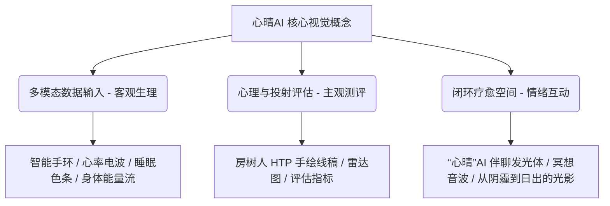

# 💖 心晴AI — 多模态抑郁检测与疗愈系统视觉宣传设计方案

本方案基于 **“心晴AI — 智能心理检测管理平台”** 的项目核心特性与代码库设计系统（包括 Garmin 手环数据同步、房树人 HTP 投射测验、AI 伴聊与多模态 Agent、自动生成雷达报告、LayuiMini 后台等），为项目量身定制了 **PPT 封面宣传图** 与 **A3 海报宣传图** 的 AI 绘画提示词（Prompts）及排版视觉设计指南。

---

## 一、 项目核心特性与视觉定位分析

在生成宣传图提示词之前，首先提取项目底层逻辑中的关键视觉符号，将**技术属性**与**疗愈温度**完美融合。



### 1. 核心视觉符号提取
*   **客观生理指标（智能手环）**：Garmin 手环数据流（心率起伏波形、深浅睡眠叠状柱形、HRV 压力曲线、身体电池能量）。在画面中表现为**流动性发光线条、平滑的脉冲波、点状数据网络**。
*   **主观投射测验（房树人 HTP）**：房屋（个体心灵的安全感）、树木（个体的生命力与成长）、人（个体的自我形象）。在画面中表现为**悬浮的轻量化 3D 霓虹手绘线条或柔和的光影轮廓**。
*   **情绪疗愈空间（心晴AI助手）**：MiniMax 伴聊模型的温暖共情。在画面中表现为**温暖的陪伴光球、呼吸律动的光波、治愈系自然元素（绿芽、温和的水流、破晓的曙光）**。
*   **医患协同后台（数据大屏）**：LayuiMini 后台的专业感。在画面中表现为**整洁的界面分栏感、圆角玻璃拟态卡片（Glassmorphism）、六维雷达图（Radar Chart）**。

### 2. 视觉色彩系统定位
为保证宣传物料与项目代码库（如 `generate_pptx.py` 与 `welcome.html` 的 CSS 标记）视觉风格高度一致，定义以下配色规范：
*   **背景基调**：极客深蓝/暗夜灰（`#070B19`），代表深邃的潜意识与专业科技背景。
*   **科技冷调**：电光蓝（`#3B82F6`）与柔和青绿（`#06B6D4`），用于表现 AI 运算、生理指标同步与高精度检测。
*   **疗愈暖调**：温暖桔黄/琥珀金（`#F59E0B`）与治愈深紫（`#8B5CF6`），用于表现情感共情、冥想疗愈与走出抑郁的心理状态。
*   **生命原色**：活力草绿（`#10B981`），用于代表房树人中的“树木”与心理状态的好转。

---

## 二、 PPT 封面宣传图设计方案

### 1. 设计思路与版面控制
*   **画幅比例**：宽屏 16:9（Midjourney 参数 `--ar 16:9`）。
*   **构图策略**：**左虚右实** 或 **右重左轻**。将主视觉图形（多模态大脑与疗愈生态的融合体）放置在右侧，左侧留出大面积的平滑深色背景（留白/Negative Space），以便在 PPT 编辑器中无干扰地叠加“项目名称、小组成员、系统入口”等文字。
*   **艺术风格**：现代 3D 玻璃拟态渲染（Glassmorphism）、微光漫反射、超写实科技感，既有医学科技的严谨，又有心理学的温柔。

```
+-----------------------------------------------------------+
|                                  .::::::::::::::::.       |
|   [ 主标题占位 ]                 .::::::::::::::::::.      |
|   心晴AI ——                     .::  右侧主视觉  ::.     |
|   多模态抑郁检测与疗愈系统        .::  (AI脑/心/自然  ::.     |
|                                  .::  元素融合体) ::.     |
|   [ 副标题及信息 ]                .::::::::::::::::::.      |
|   西北工业大学项目团队               .::::::::::::::.       |
|                                                           |
+-----------------------------------------------------------+
```

### 2. AI 绘图提示词生成

#### 选项 A：科技治愈融合风格（推荐：突出多模态与人工智能）
> **画面描述**：一个悬浮的半透明 3D 大脑与心脏结合的玻璃实体，其内部流淌着代表 Garmin 生理指标的电光蓝脉冲波。实体的右半部分逐渐生长出温暖的绿色嫩叶与粉色花瓣，代表疗愈；左半部分环绕着纤细的白色发光线稿，勾勒出一栋房子、一棵树和一个人的侧影（象征 HTP 测验）。背景为干净的深 slate 蓝色（`#070B19`），带有柔和的紫色和青色光晕。画面左侧干净留白，无杂物。

*   **Midjourney Prompt (V6.0)**
    ```text
    A premium 3D holographic cover design for a mental health presentation. The central artwork on the right features a translucent glass-morphism heart and brain fusion, containing glowing electric blue and cyan pulse waves (biometric data streams). The right side of the fusion blooms into soft green leaves and warm amber flowers, representing healing. Delicate glowing white outline sketches of a simple house, a tree, and a human profile (House-Tree-Person HTP test) float around it. Set against a dark slate-blue background (#070b19) with soft purple and teal ambient glows. The left half of the image is clean negative space with smooth dark background for text overlay. Octane render, cinematic soft lighting, clean UI/UX style, ultra-detailed, 8k resolution --ar 16:9 --style raw --v 6.0
    ```
*   **DALL-E 3 Prompt (带画面布局约束)**
    ```text
    A high-quality 3D digital illustration for a presentation cover, 16:9 aspect ratio. The background is a clean, dark slate-blue gradient. On the right side of the canvas, there is a glowing, translucent holographic symbol blending a heart and a brain. Inside this symbol, bright electric blue and soft purple light paths pulse like biometric heart rate signals. Out of this symbol grow tiny organic green leaves and glowing warm golden sparkles. Surrounding the symbol are very thin, delicate neon-white line drawings representing a house, a tree, and a human figure. The entire left side of the image is kept completely empty and dark, with a smooth, clear gradient background to allow for title text placement. No text or letters in the generated image. Cinematic studio lighting, premium UI design aesthetic.
    ```

#### 选项 B：超现实艺术疗愈风格（推荐：突出温情陪伴与走出阴霾）
> **画面描述**：一条由发光数据线条铺成的道路，从左下角的迷茫暗蓝色夜空延伸至右侧一轮散发着柔和金黄色与青绿微光的“心晴”AI 暖阳。阳光下有隐约的森林（树）与小屋（房）剪影，呈现出极为舒适的冥想治愈氛围。

*   **Midjourney Prompt (V6.0)**
    ```text
    Surreal psychological healing poster, 16:9. A road made of glowing digital pulse lines and data nodes curves from a dark indigo starry night sky on the left towards a massive, warm glowing sun sphere on the right that emits soft amber, warm yellow, and sage green light. Inside the warm sun light, there are soft silhouettes of a cozy house and a flourishing tree. A sense of transitioning from depression to hope. Clean layout with huge dark negative space on the left for presentation title. Dreamy atmosphere, smooth gradient, double exposure style, modern vector graphic design, premium aesthetic --ar 16:9 --style raw --v 6.0
    ```

---

## 三、 A3 海报宣传图设计方案

### 1. 设计思路与版面控制
*   **画幅比例**：竖版 A3 比例（约 1:1.414，Midjourney 参数可设为 `--ar 3:4` 或 `--ar 2:3`）。
*   **构图策略**：**三段式纵向叙事（评估 - 疗愈 - 追踪）**。
    *   **顶部**：深邃星空或云雾，融合多模态 AI 扫描线与 HTP 投射线稿（代表“客观检测与AI评估”）。
    *   **中部**：核心视觉焦点，一个佩戴着发光健康手环的用户正坐在一棵代表生命力的发光大树下，与代表“心晴AI”的温暖光影伴聊助手温馨互动（代表“疗愈陪伴”）。
    *   **底部**：逐渐开阔明亮，展现健康报告雷达图和起伏的情绪曲线化作的大地纹理（代表“连续追踪与回归生活”）。
*   **艺术风格**：概念数字艺术、双重曝光、治愈系插画与科技感 UI 的完美跨界交融，用色彩的冷暖过渡暗示心理状态的全面康复。

```
+-----------------------------------------------------------+
|                                                           |
|             [ 顶部：科技与评估 ]                          |
|    - 细密的多模态 AI 神经网络光点                         |
|    - HTP(房/树/人) 霓虹悬浮线条                           |
|                                                           |
|                                                           |
|             [ 中部：核心疗愈故事 ]                        |
|    - 佩戴智能手环的用户与 AI 伴聊助手(温暖光球)          |
|    - 茂盛的绿树与温暖的房屋轮廓                          |
|                                                           |
|                                                           |
|             [ 底部：追踪与数据大盘 ]                      |
|    - ECharts 情绪曲线/雷达图发光网格化作地面山川         |
|    - 留有放置项目简介与二维码的边框                       |
|                                                           |
+-----------------------------------------------------------+
```

### 2. AI 绘图提示词生成

#### 选项 A：叙事型多模态融合插画（推荐：最契合项目各模块）
> **画面描述**：一张 A3 竖版海报。画面上方是深蓝色调，布满了精致的神经网络光点、心率起伏曲线，以及半透明的房屋、大树和人像的线条画（HTP测试）。画面中部过渡为温暖的青绿和琥珀色，一个疲惫的年轻人在大树下安坐，手腕上的智能手表发散出柔和的浅蓝脉搏波，面前飘浮着一只散发温暖橙光的发光精灵（AI心理助手），给予其拥抱和安慰。画面底部是一张发光的雷达图和起伏的情绪数据折线图，化作草地上的露珠与纹理。整体色彩从冷色过渡到暖色，画面留有上下边缘的整洁边框以供排版。

*   **Midjourney Prompt (V6.0)**
    ```text
    A3 promotional poster for a multimodal AI mental health system. The poster layout goes vertically. Top section: deep indigo night sky full of glowing neural networks, pulse lines, and glowing translucent line art of a house, tree, and human figure (HTP test). Middle section: transitions into warm teal and golden-orange light, showing a person sitting peacefully under a big flourishing tree, wearing a glowing smartwatch that emits gentle ripples of light. Floating in front of them is a friendly, warm-orange glowing light spirit representing the companion AI. Bottom section: a futuristic glowing radar chart grid and wavy emotion trendlines acting as the ground surface texture. A visual journey from depression to wellness. Clean graphic composition, double exposure, high-tech meets warm healing, vibrant and professional, copyspace at the bottom --ar 3:4 --style raw --v 6.0
    ```
*   **DALL-E 3 Prompt (精准细节控制)**
    ```text
    A professional vertical poster design, A3 proportion. The visual design depicts a vertical transition from depression to mental wellness. The top portion features dark blue starry clouds with faint, glowing cyan lines of heart-rate pulses and schematic sketches of a small cottage, a branching oak tree, and a human profile. The center features a peaceful scene with a soft teal and warm golden glow, showing a person sitting under a big green tree. The person is wearing a smartwatch that glows with a faint blue ripple. In front of the person, a friendly and glowing round orange ball of light with cute abstract facial expression is floating, representing a comforting AI companion. The bottom portion of the poster features an illuminated glowing radar chart and smooth wave graphs blending into the ground. Clean design layout, surreal digital art, highly detailed, empty margins at the top and bottom for text placement.
    ```

#### 选项 B：科技极简 3D 视觉风（推荐：适合前沿学术/商业宣讲）
> **画面描述**：一张极简前沿科技海报，中央为一个巨大的、立体的、由玻璃制成的六维雷达图框架，雷达图的各个维度上分别悬浮着智能手表、房树人线稿、对话气泡、音波和太阳。雷达图内部充满温暖的光芒，折射出璀璨的虹彩（Iridescent）色泽。

*   **Midjourney Prompt (V6.0)**
    ```text
    Minimalist 3D render poster for a digital therapeutics app. In the center is a large, glass-morphism 6-dimensional radar chart. Suspended inside the radar chart's vertices are tiny, elegant glass icons: a smartwatch, a house-tree-person sketch, a chat bubble, audio waves, and a sun. Warm light refracts through the glass, casting beautiful iridescent rainbows. Sleek slate-dark background (#070b19) with glowing neon paths. Ultra-premium, clean UI design, cinematic light, high-end commercial poster style --ar 3:4 --style raw --v 6.0
    ```

---

## 四、 页面排版与宣传文案配合建议

使用 AI 工具生成背景宣传图后，可结合项目的实际参数，在制图软件（如 Photoshop、Illustrator 或 PPT）中叠加以下文字：

### 1. 推荐海报版面文案排版清单

| 模块位置 | 建议文案内容 | 设计排版建议 |
| :--- | :--- | :--- |
| **顶部大标题** | **心晴AI** <br><small>基于多模态 AI 的抑郁检测与疗愈系统</small> | 采用现代无衬线中文字体（如 *思源黑体 Bold* 或 *方正兰亭黑*），英文字体匹配项目自带的 *Outfit* 或 *Inter*。字号放大，采用白色或青色渐变。 |
| **项目 Slogan** | **“听见心声，触手可及的温度 —— 陪伴你的每一个起落。”** | 放置于主标题下方，字号适中，颜色使用科技冷光灰，字间距稍微拉开，营造呼吸感。 |
| **中部核心技术卡片** | <ul><li>**客观监测**：Garmin 手环全天候生理指标同步（心率/睡眠/身体电池/HRV压力）</li><li>**投射测评**：AI 房树人（HTP）绘画深度心理映射分析</li><li>**智能陪伴**：24h 共情大模型双向音视频情感伴聊</li><li>**闭环追踪**：生态瞬时情绪（EMA）评估与医生管理端联动</li></ul> | 建议采用**毛玻璃卡片（Glassmorphism）**的半透明白色背景框，四角设为圆角（`border-radius: 12px`），单列或双列对称排版，贴合项目后台 LayuiMini 的精细质感。 |
| **底部项目背书** | **西北工业大学智能心理健康管理团队 (SUST-EiAi-AI4AC)** | 放置于海报最下方边缘。 |
| **体验通道入口** | <ul><li>**官网**：z.playe.top</li><li>**医生端**：nwpuhs.cn</li></ul> | 右下角放置绑定了测试系统入口的二维码，方便受众扫码直接体验。 |

### 2. 页面交互动效的视觉呼应（针对官网）
如果需要将上述海报/封面元素进一步转化为前端官网（如 `welcome.html`）的 3D 轮播卡片或过渡背景，可以在 CSS 中实现以下效果：
```css
/* 呼应多模态疗愈的主色调渐变 */
.healing-gradient-bg {
  background: linear-gradient(135deg, #070B19 0%, #0c1530 40%, #1a103c 70%, #0b2230 100%);
}

/* 呼应 AI 陪伴光体的微光动效 */
.ai-companion-glow {
  box-shadow: 0 0 40px rgba(245, 158, 11, 0.4);
  animation: pulseglow 4s infinite alternate ease-in-out;
}

@keyframes pulseglow {
  0% { transform: scale(1); opacity: 0.8; }
  100% { transform: scale(1.05); opacity: 1; box-shadow: 0 0 60px rgba(6, 182, 212, 0.6); }
}
```

---
> [!TIP]
> **提示词使用建议**：
> 1. 在 **Midjourney** 中使用时，可以直接复制英文 Prompt。如果出图的效果偏灰，可以适当加入 `--stylize 250` 增强色彩饱和度。
> 2. 在 **DALL-E 3 (如 ChatGPT Plus 或 Copilot)** 中使用时，可以直接使用英文或中文 Prompt。DALL-E 3 对“左侧留空”等版面布局指令执行得更精准。
> 3. 出图后，导入 PowerPoint 或 Photoshop，将文案填入留白区域即可得到高保真专业宣传海报与 PPT 封面。

---

## 五、 AI 效果生成图预览

以下为系统根据推荐提示词（选项 A）实时生成的视觉效果图预览：

### 1. PPT 封面宣传图预览 (16:9)


### 2. A3 海报宣传图预览 (3:4)

