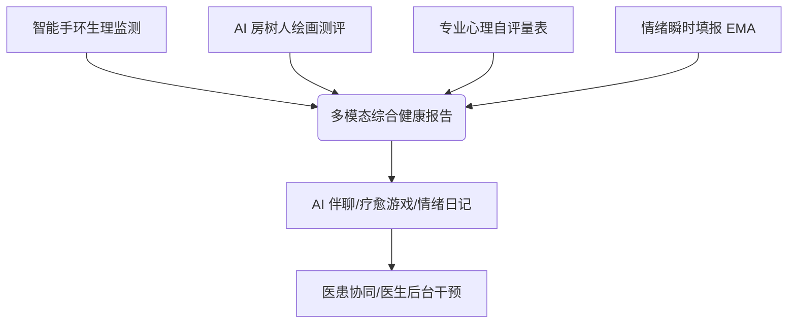

# 💖 心晴AI - 智能心理检测辅助手 H5版产品使用手册

> **产品名称**：心晴AI - 智能心理检测辅助治疗数字平台  
> **核心定位**：融合 10+ 种专业心理量表、Garmin（佳明）手环生理数据、AI房树人绘画测评、AI陪伴聊天、情绪日记于一体的多模态心理健康检测与管理平台。  
> 
> ### 🌐 平台重要入口与资源
> * **H5移动端主页**：[h.playe.top](http://h.playe.top) —— 适配手机浏览器的患者端，支持即时自评、手环数据展示、AI陪伴和画画测验。
> * **3D炫酷官网页**：[z.playe.top](http://z.playe.top) —— 平台的官方宣传推广站，采用三维卡片轮播及动态雷达图动效，为多端用户提供统一入口。
> * **医生/管理员后台**：[https://www.nwpuhs.cn/](https://www.nwpuhs.cn/) —— 医生端的核心管理后台，基于 LayuiMini 架构，用于患者健康风险预警、生理/量表数据深度钻取及 HTP 绘画审核。
> * **GitHub 开源代码库**：[https://github.com/wyxpro/healthsystem](https://github.com/wyxpro/healthsystem) —— 本项目的完整开源仓库，包含 Web 表现层、Java 后端、Garmin 同步脚本及 SQL 数据库文件。

---

## 🧭 目录

1. [产品概述与核心价值](#1-产品概述与核心价值)
2. [账号注册、登录与初始设置](#2-账号注册登录与初始设置)
3. [首页大屏与日常填报](#3-首页大屏与日常填报)
4. [AI 评估中心（画画与测评）](#4-ai-评估中心画画与测评)
    - [房树人（HTP）绘画测验](#-房树人htp绘画测验)
    - [心理测评量表（自助测评）](#-心理测评量表自助测评)
    - [医生配合量表（专业评估）](#-医生配合量表专业评估)
5. [智能手环数据同步](#5-智能手环数据同步)
6. [疗愈空间生态](#6-疗愈空间生态)
    - [心晴 AI 心理助手（聊天）](#-心晴-ai-心理助手聊天)
    - [放松减压游戏（游戏）](#-放松减压游戏游戏)
    - [情绪瞬时评估与日记](#-情绪瞬时评估与日记)
7. [多维度综合健康报告](#7-多维度综合健康报告)
8. [医患协同与后台管理](#8-医患协同与后台管理)
9. [常见问题解答（FAQ）](#9-常见问题解答faq)

---

## 1. 产品概述与核心价值

**心晴AI** 是一款创新的数字化心理健康管理平台，致力于利用前沿人工智能与可穿戴设备技术，构筑**“生理监测-心理评估-即时疗愈-趋势追踪”**的完整闭环。



### 🌟 核心特色
* **多模态融合评估**：打破传统单一量表评估的局限，结合佳明手环的生理指标（心率、睡眠、压力等）与房树人绘画投射分析，提供客观、立体的身心状况解析。
* **AI 房树人绘画分析**：运用计算机视觉算法，从画面构图、色彩、笔触、感官温度等 6 大维度对用户的“房树人（HTP）”作品进行自动化情绪投射解析。
* **24 小时陪伴疗愈**：内置深度共情的 AI 心理咨询师“心晴”，随时倾听烦恼；同时提供减压游戏与情绪日记以实现即时舒缓。
* **医患协同**：提供专业的医生端后台，方便咨询师实时关注绑定的患者，及时获知高风险状态并预警。

---

## 2. 账号注册、登录与初始设置

### 2.1 访问与运行环境
* 平台已完美适配**移动端 H5 浏览器**（推荐使用手机 Chrome、Safari、微信内置浏览器等访问 `h.playe.top`）。
* 打开网页即可体验高度流畅的类 Native App 交互。

### 2.2 注册与登录
1. **注册新账号**：
   * 点击首页右上角的 **「登录」** 按钮，若无账号，选择 **「注册」**。
   * 填写手机号、密码、短信验证码。
   * **邀请码绑定**：若您是由合作心理医生/咨询师推荐使用，请在此输入医生生成的 **6 位数字专属邀请码**，即可自动建立医患绑定关系，方便医生为您提供针对性的指导。
2. **账号登录**：输入手机号与密码即可登录。系统已启用安全 JWT Token 校验，单次登录后在一定时间内免登录。
3. **完善个人信息**：登录后，前往 **「我的」-「个人信息待完善」**，建议填写身高、体重、历史健康情况等，帮助系统建立更准确的健康档案。

---

## 3. 首页大屏与日常填报

首页作为用户日常管理身心状态的“中央控制台”，提供了清爽的视觉呈现和便捷的入口。

```
+--------------------------------------------------+
|   心晴AI - 智能心理检测辅助手                     [登录] |
+--------------------------------------------------+
|  [轮播图：科普与疗愈美文 (例如: 年轻人都想上岸...)] |
+--------------------------------------------------+
|  [每日锁推 - 日常状态] (每日 8 点解锁，记录状态)      |
+--------------------------------------------------+
|  [健康评估]   [手环数据]   [画画测评]                |
|  [疗愈空间]   [心理测评]   [迷你访谈]                |
+--------------------------------------------------+
```

### 3.1 每日锁推：日常状态填报
* **解锁机制**：系统每天早上 **08:00** 会解锁一次日常填报任务。
* **填报内容**：仅需 1 分钟，选择您昨晚的**睡眠质量**、今日的**食欲**、**精力**、**情绪**，以及有无**身体不适**和**用药情况**。
* **填报提醒**：默认每晚 **21:00** 系统会通过推送提醒未填报的用户进行补填，以维持连续的健康记录。

### 3.2 快捷服务卡片
* **健康评估 / 手环数据 / 画画测评 / 疗愈 / 心理测评 / 迷你访谈**，均可通过首页中部格栅卡片一键直达。

---

## 4. AI 评估中心（画画与测评）

点击首页的「画画测评」或「心理测评」，即可进入 AI 评估模块。该模块包含 **画画（HTP 投射测验）**、**测评（自助量表）**、**评估（专业量表）** 三个标签页。

### 🎨 房树人（HTP）绘画测验
房树人测验（House-Tree-Person Test）是一种经典的投射性心理测验。用户被要求在一张画纸上绘制房屋、树木和人。

```
 🎨 画画测验流程：
点击 [开始绘画测验] -> 拿起画笔（在画布上手绘） -> 绘制完毕提交 -> AI 提取画面特征 -> 生成 6 维分析报告
```

* **手绘板交互**：H5 版内置了流畅的手绘板，您可以自由调节画笔颜色、粗细，并在画布上绘制心中的“房屋、树木和人物”。
* **AI 多维度量化解析**：提交后，AI 算法将针对以下六大维度自动生成量化得分与心理学分析：
  1. **色彩运用**：评估颜色多样性、冷暖色调的协调性与情绪色彩。
  2. **笔触特征**：分析绘图笔触的力度、连贯性与摩擦阻抗。
  3. **画面构图**：评估画面的饱满度、空白占比与空间分布倾向。
  4. **叙事逻辑**：识别画面元素的关联性与表达积极性。
  5. **构图合理性**：分析画面结构的秩序感、大小对称与稳定度。
  6. **感官感受**：综合评估画面带来的温暖度、舒适感与内心平衡状态。

---

### 📝 心理测评量表（自助测评）
提供多款国际标准的心理学及生理状态筛查量表，便于用户对自己的身体与精神状态进行日常监测：

| 量表名称 | 全称及功能 | 题目数量 | 建议检测频率 |
| :--- | :--- | :---: | :---: |
| **SCL-90** | **症状自评量表**：全面筛查近一周内各种心理障碍及躯体化症状。 | 90 题 | 每月一次 |
| **OCEAN** | **大五人格量表**：评估神经质、外倾性、开放性、顺应性、尽责性人格。 | 60 题 | 单次评定即可 |
| **MAIA-2** | **多维度内受感觉觉知量表**：检测对身体感官信号的感知与情绪调节能力。 | 37 题 | 每两周一次 |
| **CD-RISC**| **心理弹性量表**：测量面对压力、挫折时的心理复原力。 | 25 题 | 每月一次 |
| **PSQI** | **匹兹堡睡眠质量指数**：评估近一个月的睡眠时间、效率、障碍等。 | 18 题 | 每周一次 |
| **IPAQ** | **国际身体活动量表**：量化过去一周的中高强度体力活动及久坐时间。 | 7 题 | 每周一次 |
| **PARS-3** | **体育活动等级量表**：评估上个月的体育锻炼量（时间、频次、强度）。| 5 题 | 每周一次 |

---

### 🩺 医生配合量表（专业评估）
此标签页包含常用于临床抑郁与焦虑筛查的黄金标准量表，系统会自动算出原始分与标准分，并生成包含改善建议的诊断报告：
* **SDS 抑郁自评量表**（20 题）：评估是否存在抑郁情绪及其严重程度。
* **SAS 焦虑自评量表**（20 题）：评估是否存在焦虑状态及身体躯体化感觉。
* **PSS 压力感知量表**（14 题）：感知日常生活事件所带来的压力水平。

---

## 5. 智能手环数据同步

心晴AI 支持同步 **Garmin（佳明）** 智能手环数据。通过生理数据与心理记录的结合，更科学地预测心理健康走势。

### 5.1 数据同步流程
1. **绑定 Garmin 账号**：首次使用时，在**「首页」-「手环数据」**或**「我的」**页面中，输入您的 Garmin Connect 账号与密码。
2. **佩戴与日常采集**：用户只需正常佩戴手环，手环会自动将生理数据上传至 Garmin 云端。
3. **后台自动拉取**：平台后台 Python 定时脚本将自动（每小时）拉取佳明云端数据，安全同步至您的心晴AI账户。

### 5.2 监测指标说明
* **心率 (Heart Rate)**：监控全天实时心率、静息心率 (RHR) 的变化。
* **睡眠 (Sleep)**：记录总睡眠时长，细分深睡眠、浅睡眠、快速眼动 (REM) 阶段，评估睡眠评分。
* **步数与活动 (Steps & Activities)**：计算全天步数、活动距离及卡路里消耗。
* **血氧饱和度 (SpO2)**：检测夜间及日常血氧，防范睡眠呼吸暂停风险。
* **压力指数 (Stress)**：利用心率变异性 (HRV) 评估全天压力起伏，生成压力分布曲线。
* **身体能量 (Body Battery)**：评估身体充电（睡眠）与消耗（运动、压力）的平衡值。

---

## 6. 疗愈空间生态

在「疗愈」标签页下，平台构建了集“倾诉、娱乐、记录”于一体的自我调节港湾。

### 💬 心晴 AI 心理助手（聊天）
* **24 小时在线**：随时双向沟通，提供即时、温暖的情绪反馈。
* **专业背景**：AI 基于专业心理咨询伦理与话术微调，具备倾听、澄清、认知重构与行为引导能力。
* **丰富交互**：支持发送文字、趣味表情包，并提供**语音输入**，方便用户在情绪低落懒得打字时以语音倾诉。

### 🎮 放松减压游戏（游戏）
* **游戏名称**：*神庙逃亡 2 (Temple Run 2) - Holi Festival 跑酷关卡*。
* **疗愈机制**：通过高度专注的敏捷跑酷，帮助大脑暂时切断焦虑杂念，释放多巴胺，缓解精神紧绷。
* **操作说明**（可在手机屏幕上滑屏或在浏览器全屏操作）：
  * **滑屏向上**：跳跃障碍
  * **滑屏向下**：下滑躲避
  * **滑屏向左 / 向右**：转弯避险

### 🎭 情绪瞬时评估与日记
* **EMA 情绪评估**：每天可在不同时间点，通过点击 16 种情绪脸谱（如：喜悦、郁闷、焦虑、平静等）快速标记心情，并拉动滑块调节强度（1-5级），生成当日瞬时情绪曲线。
* **情绪日记**：支持记录下当时的感受、发生的事件和心路历程，作为个人的情绪演变日记本。

---

## 7. 多维度综合健康报告

在 **「我的」-「健康报告」** 中，系统会将您近期的所有数据融汇贯通，生成一份权威的雷达图健康报告：

```
                    【综合健康评估】
                      
                          心理弹性
                             /\
                  情绪状态 /    \ 睡眠质量
                         |   o    | 
                  压力管理 \    / 身体活动
                             \/
                          焦虑水平
```

* **健康得分（0-100 分）**：基于生理指标、量表风险及情绪稳定性，给出身心健康的综合量化评分。
* **六维雷达图**：直观展示您在心理弹性、睡眠质量、身体活动、焦虑水平、压力管理和情绪状态上的优势与短板。
* **HTP 房树人报告速览**：展示您最近一次提交的绘画测验评分（例如：“59分 - 心理状态平稳”），并以色彩条条形图的形式对比展示画面色彩、笔触、面积积极性等细节。
* **异常预警**：若某项指标长期处于高危值（如 PSQI 极差或 SDS 标准分超标），报告将亮起彩色徽章预警，并建议联系绑定医生。

---

## 8. 医患协同与后台管理

对于**医生/心理咨询师及系统管理员**，平台提供了基于 Web 端的管理系统，可通过访问 [https://www.nwpuhs.cn/](https://www.nwpuhs.cn/) 登录（后台基于 LayuiMini 框架开发）。

登录系统后，医生可以通过左侧的导航菜单使用以下 10 个核心功能模块：

```
+------------------+
|   HealthSystem   |
+------------------+
| 👤 用户管理       |
| 📊 用户填报详情    |
| 📊 整体情况分析    |
| 📊 压力情况分析    |
| 📊 健康情况分析    |
| 🖼️ HTP房树人分析   |
| 📑 7维量表分析     |
| 💬 AI聊天分析     |
| 📝 日记分析       |
| 💖 健康报告       |
+------------------+
```

### 8.1 👤 用户管理
* **功能描述**：用于查看与检索系统内绑定的所有患者基本信息，并进行批量操作。
* **具体使用**：
  * **搜索信息**：支持通过「用户名」、「用户真实姓名」、「用户性别」进行组合模糊检索。
  * **功能按钮**：
    * **「添加新用户」**：手动录入新患者账号。
    * **「批量标注用户」**：对选中的多名患者进行高风险等级标注或分类分组。
    * **「获取选中数目」**：快速统计当前表格中打勾选中的记录条数。
  * **用户绑定与邀请**：医生可在该页面生成专属的 **「6位数字邀请码」** 或 **「绑定二维码」**，分发给患者以便在 H5 注册时进行自动医患绑定。

### 8.2 📊 用户填报详情
* **功能描述**：集中展示患者每日“日常状态填报”的原始明细，帮助医生监督其记录的依从性并快速发现数据断档。
* **具体使用**：
  * **数据明细**：列表展示患者每日录入的「睡眠质量」、「食欲状况」、「精力水平」、「情绪状态」、以及「是否用药」和「身体不适表现」。
  * **检索与回溯**：支持按照特定患者姓名、填报日期范围进行筛选，导出该患者的日常记录明细。

### 8.3 📊 整体情况分析
* **功能描述**：从宏观角度对名下所有患者或指定个体的身心指标进行全局分析。
* **具体使用**：
  * 展示患者情绪效价（Valence）与唤醒度（Arousal）的散点趋势图。
  * 统计整体填报率、预警率，并以饼图形式呈现名下患者当前处于“红、黄、绿”三色风险预警的占比分布，以便快速定位需要紧急干预的对象。

### 8.4 📊 压力情况分析
* **功能描述**：整合生理压力（手环）与主观压力感知（PSS量表），对患者压力水平进行全面画像。
* **具体使用**：
  * **全天压力曲线**：读取佳明手环上传的 HRV 压力数据，按小时渲染压力值曲线。
  * **压力区间分布**：可视化统计患者全天在「极高压力」、「中等压力」、「低压力」和「放松休息」四个区间的时长占比。
  * **主观压力对比**：结合 PSS-14 压力量表历史得分，判断患者的身体压力是否与心理感知压力一致。

### 8.5 📊 健康情况分析
* **功能描述**：侧重展示智能手环采集的纯生理核心健康指标，追踪身体机能变化。
* **具体使用**：
  * **心率监控**：提供静息心率趋势折线图以及运动心率带区间。
  * **睡眠结构**：以柱状堆叠图展示深睡眠、浅睡眠、REM快速眼动睡眠的时长分布，以及 PSQI 睡眠评分。
  * **血氧饱和度 (SpO2)**：监控夜间血氧波动，预警睡眠呼吸障碍。
  * **步数与电量**：追踪每日步数和身体电量 (Body Battery) 充电/消耗差值，评估患者生理能量恢复状态。

### 8.6 🖼️ HTP房树人分析
* **功能描述**：用于集中查阅与解析患者提交的房树人手绘测验。
* **具体使用**：
  * **原始画作大图预览**：点击缩略图可查看患者提交的原始手绘图片。
  * **AI评分详情**：直观展示色彩运用、笔触特征、画面构图、叙事逻辑、构图合理性、感官感受 6 个指标的条形对比图，并附带 AI 详细评语。
  * **风险定位**：标记 HTP 测验的抑郁或焦虑倾向评估结果（正常、轻度、中度、重度风险）。

### 8.7 📑 7维量表分析
* **功能描述**：对 7 大心理及行为量表（SCL-90, PSQI, OCEAN, MAIA-2, CD-RISC, IPAQ, PARS-3）进行多维数据统计与诊断。
* **具体使用**：
  * **一键Tab切换**：支持 7 个量表独立页签切换，快速查看不同量表的填报数据。
  * **彩色风险徽章**：对于得高分的量表，系统会自动用 **红色/黄色** 高亮标注（如：SCL-90重度、PSQI中度睡眠障碍）。
  * **综合智能报告**：点击某位用户，系统可根据其名下全部量表数据交叉验证，生成一份综合性的心理测评总结。

### 8.8 💬 AI聊天分析
* **功能描述**：监控并分析患者与 AI 助手“心晴”的互动会话，掌握患者的日常情感基调（严守医疗隐私规范）。
* **具体使用**：
  * **会话对话日志**：查看患者与 AI 的聊天对话详情，掌握患者当前的纠结焦点或消极诉求。
  * **情感统计**：通过 NLP 算法自动计算并展示该段会话的「正面情绪度」、「中性情绪度」与「负面情绪度」评分及占比饼图。
  * **危机词预警**：对聊天内容中的敏感、自残等词汇进行高危标记，触发系统即时警报。

### 8.9 📝 日记分析
* **功能描述**：查阅患者在疗愈空间中记录的日常日记，追踪其自我表达背后的情感起伏。
* **具体使用**：
  * **日记明细**：分页查看日记正文，支持搜索特定关键词。
  * **日记删除**：若患者发生误操作或要求删除敏感日记，医生在获得授权后可执行快捷清理。
  * **情绪走势**：提取日记文字中的情感色彩值（1-100），并生成日记情绪演变折线图。

### 8.10 💖 健康报告
* **功能描述**：该模块为最终的会诊与评估报告输出中心。
* **具体使用**：
  * **多维雷达图渲染**：系统自动调用 ECharts 将患者最近的生理及量表指标转换为综合雷达图。
  * **一键导出**：支持将雷达图连同数据报表一键导出为 PDF 或 PNG 图片，用于临床存档。
  * **医生综合意见录入**：医生可在该页面直接输入针对雷达图指标的专业诊断意见和用药/调理建议，保存后将即时推送到患者 H5 端的「健康报告」模块中。

---

## 9. 常见问题解答（FAQ）

### Q1：我的 Garmin 数据没有同步，该怎么办？
> **答**：
> 1. 请确保在系统内绑定的 Garmin 账号与密码正确。
> 2. 请确保您的手环已通过手机上的 Garmin Connect App 同步到了佳明云端。
> 3. 由于跨国云端服务器延迟，数据可能有 10-30 分钟的滞后，请耐心等待或手动在手环页面触发同步。

### Q2：房树人（HTP）画画测验的 AI 评估是绝对精准的吗？
> **答**：HTP 测验是一种“投射性”测评工具，AI 的画面解析是基于海量绘画心理学特征库做出的倾向性评估，其结果具有很好的筛查与辅助参考价值，但不代表最终的临床医学诊断。如感严重不适，请向绑定的医生发起咨询或就医。

### Q3：我的聊天内容和日记会被其他人看到吗？
> **答**：系统严格遵守心理学咨询伦理与隐私保护法案。所有的聊天、日记及量表隐私数据均经过高级对称加密（AES/RSA）传输与存储。仅有您授权绑定的主治/咨询医生可在后台出于干预目的查阅相关分析，其他无关人员均无权访问。

### Q4：为什么我的日常填报打不开了？
> **答**：为了引导用户建立规律的日常反思习惯，日常状态填报设计为“每日锁推”模式，每天早上 8:00 解锁，当天只能填报一次。如果您已填写，需等到次日解锁。

---
* 保持健康，从了解自己开始。祝您拥有一份晴朗的心情！ ☀️ *
