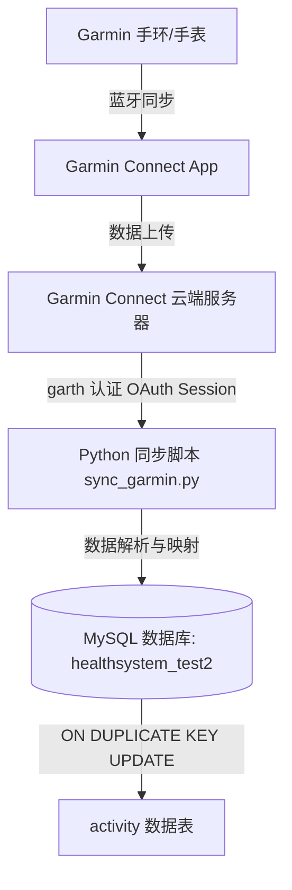

# Garmin 手环/手表数据同步至数据库配置指南

本文档为 Garmin（佳明）手环/手表健康数据同步至系统的数据库表（`healthsystem_test2` 的 `activity` 表）的标准操作指南。

---

## 一、同步流程架构



---

## 二、前置条件与环境准备

### 1. 账号与设备要求
- **Garmin Connect 账号**：已开通并正常绑定的佳明账号（区分**中国区** `connect.garmin.cn` 与 **国际区** `connect.garmin.com`）。
- **设备适配**：手环/手表已被 Garmin Connect App 成功绑定并可同步数据。

### 2. 数据库说明
系统的 healthsystems 数据库表结构如下：
- **数据库名**：`healthsystem_test2`
- **目标表**：`activity`（每日健康与活动汇总表）
- **关键约束**：拥有唯一索引 `UNIQUE KEY unique_entry (email, date)`，避免重复拉取造成数据冗余。

### 3. Python 环境依赖安装
在命令行执行以下命令安装所需依赖库：

```bash
cd e:\Code\AI\Start\Web\Mindapp\healthsystems\python-garminconnect-master
pip install garminconnect garth pymysql requests
```

---

## 三、Garmin 认证与 Token 持久化机制（核心避坑）

### 为什么需要 Token 持久化？
1. **防止账号封禁/频繁验证码**：频繁通过 `账号+密码` 请求登录接口易触发 Garmin 防刷限流机制（`HTTP 429 Too Many Requests`）或二次验证（MFA）。
2. **长效 Session 保持**：`garth` 库生成的 OAuth Token 有效期最长可达 **1 年**。
3. **免密自动运行**：将生成的凭证保存到本地（默认 `~/.garminconnect`），定时脚本运行时优先读取缓存 Token 恢复 Session。

---

## 四、操作步骤

### 步骤 1：填入账号密码配置（修改 `.env` 文件）

打开 `python-garminconnect-master/.env` 配置文件，填入您的佳明账号和密码：

```env
# 佳明 Connect 账号信息 (填入您的实际邮箱和密码)
GARMIN_EMAIL=your_email@163.com
GARMIN_PASSWORD=your_password

# 国内购买绑定的佳明账号默认为中国区 connect.garmin.cn (True)
GARMIN_IS_CN=True

# 数据库连接参数 (已预设健康系统数据库默认值)
DB_HOST=127.0.0.1
DB_PORT=3306
DB_USER=root
DB_PASS=123456
DB_NAME=healthsystem_test2
SYNC_DAYS_BACK=7
```

---

### 步骤 2：一键测试运行启动脚本

**方式 A：双击批处理脚本（最简单）**
在 Windows 资源管理器中双击打开：
`e:\Code\AI\Start\Web\Mindapp\healthsystems\python-garminconnect-master\run_sync.bat`

**方式 B：通过 PowerShell 运行**
```powershell
powershell -ExecutionPolicy Bypass -File e:\Code\AI\Start\Web\Mindapp\healthsystems\python-garminconnect-master\run_sync.ps1
```

**方式 C：直接运行 Python 脚本**
```powershell
cd e:\Code\AI\Start\Web\Mindapp\healthsystems\python-garminconnect-master
python sync_garmin.py
```

**运行预期输出示例：**

```plain
=== Garmin 手环数据同步任务启动 ===
2026-07-22 16:00:00 [INFO] 正在准备初始化 Garmin 客户端 (账号: xxx@163.com, 是否中国区: True)...
2026-07-22 16:00:01 [INFO] 进行账号密码登录认证...
2026-07-22 16:00:03 [INFO] 登录成功，凭证已保存至本地 Token 目录: C:\Users\Administrator\.garminconnect
2026-07-22 16:00:03 [INFO] 同步日期范围: 2026-07-15 至 2026-07-22
2026-07-22 16:00:04 [INFO] 正在拉取日期 [2026-07-15] 的手环健康概览数据...
2026-07-22 16:00:05 [INFO] 数据插入/更新成功！[日期: 2026-07-15, 用户: xxx@163.com, 步数: 8520, 卡路里: 2150.0]
...
=== Garmin 手环数据同步完成 ===
```

---

### 步骤 3：数据库写入结果校验

使用 Navicat 或 MySQL 命令行查询是否入库成功：

```sql
USE healthsystem_test2;

SELECT 
    date, 
    email, 
    totalSteps, 
    totalKilocalories, 
    activeKilocalories, 
    restingHeartRate, 
    averageStressLevel, 
    bodyBatteryChargedValue, 
    source 
FROM activity 
WHERE source = 'GARMIN' 
ORDER BY date DESC 
LIMIT 10;
```

---

### 步骤 4：配置 Windows 自动定时同步任务

为实现手环数据每日自动抓取，建议在服务器/电脑上配置 **Windows 计划任务（Task Scheduler）**：

1. 按 `Win + R` 键，输入 `taskschd.msc` 并回车，打开“任务计划程序”。
2. 点击右侧“**创建基本任务**”，命名为 `Garmin-Handband-Sync`。
3. **触发器**：选择“每天”，设置时间（推荐设定为每天夜间 **23:30** 或凌晨 **01:00**）。
4. **操作**：选择“启动程序”。
   - **程序或脚本**：`e:\Code\AI\Start\Web\Mindapp\healthsystems\python-garminconnect-master\run_sync.bat`
5. 点击“完成”。系统将在设定时间自动静默触发手环数据同步。

---

## 五、字段映射参考表

下表为 Garmin Connect 返回 JSON 数据与数据库 `activity` 表的字段对应关系：

| 数据库字段 | Garmin 数据来源 key | 类型 | 含义说明 |
| :--- | :--- | :--- | :--- |
| `date` | `calendarDate` | datetime | 日期（标准格式：`YYYY-MM-DD 00:00:00`） |
| `email` | 配置的 `GARMIN_EMAIL` | varchar | 用户唯一标识 |
| `totalSteps` | `totalSteps` | int | 每日总步数 |
| `totalKilocalories` | `totalKilocalories` | float | 每日总消耗卡路里 (kcal) |
| `activeKilocalories` | `activeKilocalories` | float | 动态/运动消耗卡路里 (kcal) |
| `bmrKilocalories` | `bmrKilocalories` | float | 基础代谢卡路里 (kcal) |
| `totalDistanceMeters` | `totalDistanceMeters` | float | 每日移动总距离 (米) |
| `restingHeartRate` | `restingHeartRate` | varchar/int | 静息心率 (bpm) |
| `minHeartRate` | `minHeartRate` | varchar/int | 当天最低心率 |
| `maxHeartRate` | `maxHeartRate` | varchar/int | 当天最高心率 |
| `sleepingSeconds` | `sleepingSeconds` | varchar/int | 总睡眠时长 (秒) |
| `averageStressLevel` | `averageStressLevel` | varchar/int | 每日平均压力分数 |
| `maxStressLevel` | `maxStressLevel` | varchar/int | 每日最高压力分数 |
| `stressQualifier` | `stressQualifier` | varchar | 压力评估文本（如 `STRESSFUL`, `BALANCED`） |
| `bodyBatteryChargedValue` | `bodyBatteryChargedValue` | int | 身体电量 (Body Battery) 充电储备值 |
| `bodyBatteryDrainedValue` | `bodyBatteryDrainedValue` | int | 身体电量消耗值 |
| `averageSpo2` | `averageSpo2` | varchar/float | 平均血氧饱和度 (%) |
| `avgWakingRespirationValue` | `avgWakingRespirationValue` | int | 清醒时平均呼吸率 (次/分) |
| `source` | `'GARMIN'` | varchar | 数据来源标记 |

---

## 六、常见问题及排查指南

### 1. `GarminConnectAuthenticationError` (认证失败)
- **原因**：邮箱/密码填写错误，或中国区标志 `is_cn` 未设置正确。
- **解决方案**：在国内购买和注册的手环/手表账号，**必须将 `GARMIN_IS_CN` 设为 `True`**（对应域名 `connect.garmin.cn`）。

### 2. `HTTP 429 Too Many Requests` (请求频控)
- **原因**：短时间内多次调用登录接口。
- **解决方案**：检查 `~/.garminconnect` Token 文件是否存在。Token 文件存在时会自动免密加载。

### 3. 数据为空/全为 None
- **原因**：当天手环未与手机 Garmin Connect App 同步，或蓝牙断开。
- **解决方案**：打开手机上的 Garmin Connect App，手动下滑拉取刷新手环数据，确认手机 App 上有步数/心率记录后再重新运行同步脚本。

### 4. 数据库提示 `Access denied` 或无法连接
- **原因**：MySQL 账号密码不匹配，或数据库 `healthsystem_test2` 未建立。
- **解决方案**：查阅根目录下 `database/sql.md` 验证数据库连接参数及导入步骤。
