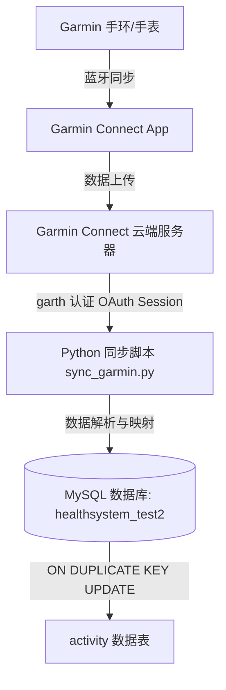

# Garmin 手环/手表数据同步至数据库配置指南

本文档为 Garmin（佳明）手环/手表健康数据同步至系统的数据库表（`healthsystem_test2` 的 `activity` 表）的标准操作指南。

---

## 一、同步流程架构



---

## 二、前置条件与环境准备

### 1. 账号与设备要求
- **Garmin Connect 账号**：已开通并正常绑定的佳明账号（区分**中国区** `connect.garmin.cn` 与 **国际区** `connect.garmin.com`）。
- **设备适配**：手环/手表已被 Garmin Connect App 成功绑定并可同步数据。

### 2. 数据库说明
系统的 healthsystems 数据库表结构如下：
- **数据库名**：`healthsystem_test2`
- **目标表**：`activity`（每日健康与活动汇总表）
- **关键约束**：拥有唯一索引 `UNIQUE KEY unique_entry (email, date)`，避免重复拉取造成数据冗余。

### 3. Python 环境依赖安装
在命令行执行以下命令安装所需依赖库：

```bash
cd e:\Code\AI\Start\Web\Mindapp\healthsystems\python-garminconnect-master
pip install garminconnect garth pymysql requests
```

---

## 三、Garmin 认证与 Token 持久化机制（核心避坑）

### 为什么需要 Token 持久化？
1. **防止账号封禁/频繁验证码**：频繁通过 `账号+密码` 请求登录接口易触发 Garmin 防刷限流机制（`HTTP 429 Too Many Requests`）或二次验证（MFA）。
2. **长效 Session 保持**：`garth` 库生成的 OAuth Token 有效期最长可达 **1 年**。
3. **免密自动运行**：将生成的凭证保存到本地（默认 `~/.garminconnect`），定时脚本运行时优先读取缓存 Token 恢复 Session。

---

## 四、操作步骤

### 步骤 1：填入账号密码配置（修改 `.env` 文件）

打开 `python-garminconnect-master/.env` 配置文件，填入您的佳明账号和密码：

```env
# 佳明 Connect 账号信息 (填入您的实际邮箱和密码)
GARMIN_EMAIL=your_email@163.com
GARMIN_PASSWORD=your_password

# 国内购买绑定的佳明账号默认为中国区 connect.garmin.cn (True)
GARMIN_IS_CN=True

# 数据库连接参数 (已预设健康系统数据库默认值)
DB_HOST=127.0.0.1
DB_PORT=3306
DB_USER=root
DB_PASS=123456
DB_NAME=healthsystem_test2
SYNC_DAYS_BACK=7
```

---

### 步骤 2：一键测试运行启动脚本

**方式 A：双击批处理脚本（最简单）**
在 Windows 资源管理器中双击打开：
`e:\Code\AI\Start\Web\Mindapp\healthsystems\python-garminconnect-master\run_sync.bat`

**方式 B：通过 PowerShell 运行**
```powershell
powershell -ExecutionPolicy Bypass -File e:\Code\AI\Start\Web\Mindapp\healthsystems\python-garminconnect-master\run_sync.ps1
```

**方式 C：直接运行 Python 脚本**
```powershell
cd e:\Code\AI\Start\Web\Mindapp\healthsystems\python-garminconnect-master
python sync_garmin.py
```

---

## 五、常见问题及排查指南

### 1. `GarminConnectAuthenticationError` (认证失败)
- **原因**：邮箱/密码填写错误，或中国区标志 `is_cn` 未设置正确。
- **解决方案**：在国内购买和注册的手环/手表账号，**必须将 `GARMIN_IS_CN` 设为 `True`**（对应域名 `connect.garmin.cn`）。

### 2. `HTTP 429 Too Many Requests` (请求频控)
- **原因**：短时间内多次调用登录接口。
- **解决方案**：检查 `~/.garminconnect` Token 文件是否存在。Token 文件存在时会自动免密加载。
